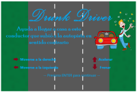
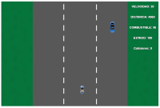
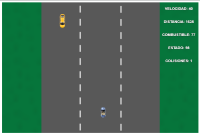
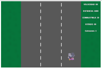
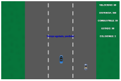
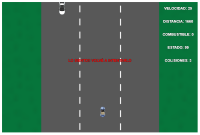
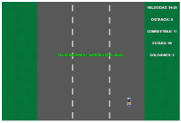

# Drunk Driver

## Equipo de desarrollo

- DIAZ, MARCELO FABIÁN
- FAJARDO, MARÍA EUGENIA

## Capturas

    
    
    
    
    
    
    

## Reglas de Juego / Instrucciones

## Terminar el recorrido en una pieza!

Cosas a tener en cuenta:

* El conductor está **borracho** y va en sentido contrario a los otros autos;  
* No se avanza en forma vertical.
* En la pantalla hay un tablero informativo a la derecha donde se detallan: el estado del jugador, la distancia por recorrer, la velocidad, la cantidad de colisiones provocadas por el Jugador y de combustible restante.
* Deben evadirse los vehículos que aparezcan utilizando las teclas derecha e izquierda del teclado.
* Es posible aumentar la velocidad y/o frenar haciendo uso de las tecla arriba y abajo respectivamente.
* El juego tiene un tiempo de duración, cumplido el mismo se pierde la ronda y debe reiniciarse el nivel.
* Si se termina el combustible o el estado del jugador llega a 0, se pierde la ronda y debe reiniciarse el nivel.
* Para ganar basta con haber recorrido la distancia propia del nivel, cuando la distancia por recorrer llega a 0, el Jugador gana; superándose así el nivel!

## Otros

- UNAHUR - Instituto de Tecnología e Ingeniería
- Versión de wollok: 0.2.7
- Una vez terminado, queremos manternerlo privado.
<link rel="stylesheet" href="styles/styles.css">
